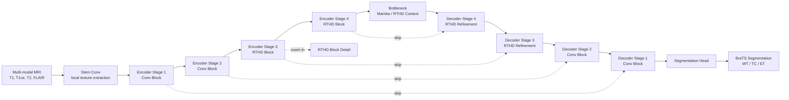
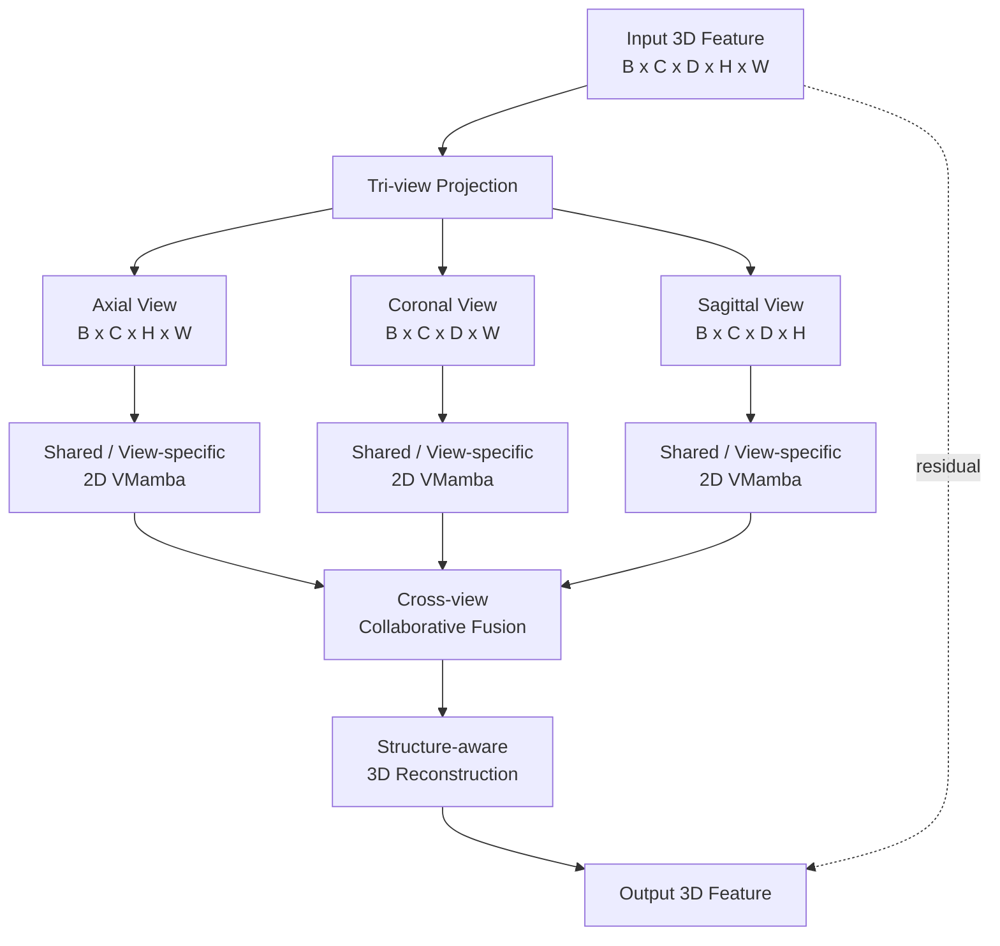
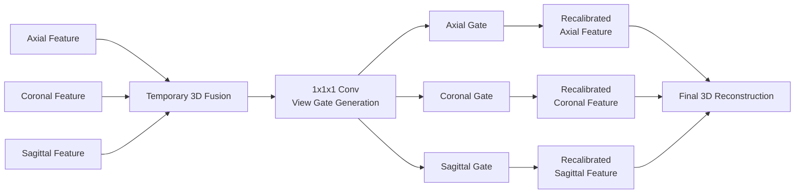
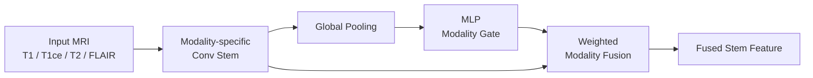
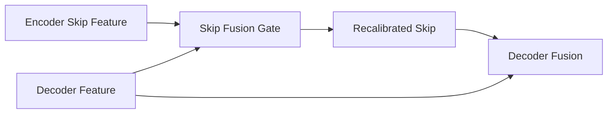
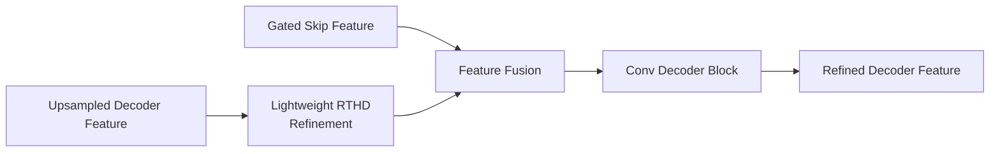
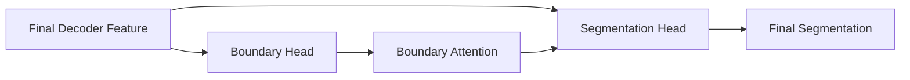

# RTHD 总体架构图绘制方案

## 一、先解决一个关键误区

总体架构图不要画成：

`U-Mamba 的每一层细节 + RTHD 内部每一步细节`

这样会非常乱，而且显得你只是往编码器里塞了一个小模块。

更推荐画成三层结构：

1. `总体网络图`：说明 RTHD 被部署在 U-shaped encoder-decoder 的哪些阶段。
2. `RTHD Block 放大图`：说明 RTHD 内部如何从 3D 到三视图，再回到 3D。
3. `Cross-view Fusion 小图`：说明三视图不是简单相加，而是有跨视图协同。

论文主图可以采用：

`左侧总体网络 + 右侧 RTHD block 放大框`

这样既能看出整体网络，又能体现你的核心创新。

## 二、总体图的推荐叙事

图名可以写：

`Overall architecture of the proposed RTHD-UMamba network`

中文：

`所提出 RTHD-UMamba 网络总体架构`

图中不要只写“Encoder 改进”，而要画出：

- 输入是多模态 MRI
- 主体是 U-shaped encoder-decoder
- RTHD 部署在编码器中高层
- 可选地在解码器高层加入轻量 refinement
- 输出 BraTS 三个区域或多类分割结果

这样它就不是一个“编码器小补丁”，而是一个完整分割网络。

## 三、总体架构图草图

可以直接用下面这个 Mermaid 先定结构。

绘图时可以把：

- `Conv Block` 用灰色
- `RTHD Block` 用蓝绿色
- `RTHD Refinement` 用浅蓝色
- `skip connection` 用虚线
- `RTHD Block Detail` 用放大框

## 四、RTHD Block 放大图

这是你最核心的模块图。

图名可以写：

`Recursive Tri-view Hierarchical Decomposition Block`

或者：

`RTHD Block`

模块内部建议画成：

`3D Feature -> Tri-view Projection -> Axial/Coronal/Sagittal 2D Mamba -> Cross-view Fusion -> Structure-aware Reconstruction -> Output`

Mermaid 草图：

这里最重要的是：  
不要只画三路扫描再相加。一定要把 `Cross-view Collaborative Fusion` 单独画出来，否则创新感会弱。

## 五、Cross-view Fusion 小图

如果你要再画一个子图，建议画这个。

图名：

`Cross-view Collaborative Fusion`

草图：

这张图的作用是回答一个问题：

`三视图之间到底怎么交互？`

## 六、最终论文里建议放几张图

如果只放一张图，建议放：

`总体网络 + RTHD block 放大框`

如果可以放两张图，建议：

1. `Figure 1: Overall architecture of RTHD-UMamba`
2. `Figure 2: Details of RTHD block and cross-view fusion`

如果章节比较长，可以放三张：

1. 总体网络图
2. RTHD block 细节图
3. 跨视图协同融合图

## 七、总体图中每个模块建议写什么

不要写太长，图里的文字越短越好。

推荐标签：

- `Multi-modal MRI`
- `Stem Conv`
- `Conv Encoder`
- `RTHD Encoder`
- `Bottleneck`
- `RTHD Decoder Refinement`
- `Segmentation Head`
- `WT / TC / ET`
- `Tri-view Projection`
- `2D VMamba`
- `Cross-view Fusion`
- `3D Reconstruction`

不推荐标签：

- `this module improves long-range dependencies`
- `this is used to reduce computational complexity`
- `we use this block to improve segmentation`

这些解释应该写在正文里，不应该塞到图里。

## 八、最适合你当前论文的最终版本

我建议你最终采用这个结构：

`Figure 1 = 左侧 U-shaped 总体网络 + 右侧 RTHD Block 放大框`

左侧画：

`Input -> Stem -> Encoder1 -> Encoder2 -> RTHD Encoder3 -> RTHD Encoder4 -> Bottleneck -> RTHD Decoder4 -> RTHD Decoder3 -> Decoder2 -> Decoder1 -> Output`

右侧放大：

`3D Feature -> Tri-view Projection -> Axial/Coronal/Sagittal VMamba -> Cross-view Fusion -> Structure-aware Reconstruction -> Residual Output`

这样图就能同时表达：

- 你不是只做了一个局部小组件
- RTHD 有清楚的内部结构
- 方法和 U-Mamba 主干是自然结合的
- 论文可以围绕三个创新点展开

## 九、画图时的版式建议

建议采用横向布局：

- 左 65%：总体 U-shaped 网络
- 右 35%：RTHD block 放大图

颜色建议：

- 灰色：普通卷积模块
- 蓝绿色：RTHD 模块
- 淡橙色：Cross-view Fusion
- 紫色或深蓝：输出 head

连线建议：

- 主干用实线
- skip connection 用虚线
- zoom-in 指向 RTHD block 用点划线

视觉重点：

- 不要画太多小卷积
- 不要把每个 stage 里的重复层全展开
- RTHD block 要比普通 conv block 更醒目
- 图里只保留英文短标签，中文解释放正文

## 十、可以直接作为图注的文字

中文图注：

`图 X 展示了所提出的 RTHD-UMamba 网络总体结构。网络采用 U-shaped 编码器-解码器框架，在编码器中高层引入 RTHD 模块以进行轻量化多视图状态空间建模，并在解码器高层加入 RTHD refinement 以增强结构恢复能力。RTHD 模块首先将 3D 特征分解为轴向、冠状位和矢状位三个二维视图，分别通过 2D VMamba 建模长程依赖，然后利用跨视图协同融合模块建模不同解剖平面间的互补关系，最后通过结构感知重建恢复 3D 表示。`

英文图注：

`Overall architecture of the proposed RTHD-UMamba network. The model follows a U-shaped encoder-decoder design, where RTHD blocks are inserted into high-level encoder stages for lightweight multi-view state space modeling and into selected decoder stages for structure-aware refinement. Each RTHD block decomposes a 3D feature map into axial, coronal, and sagittal views, models long-range dependencies with 2D VMamba, performs cross-view collaborative fusion, and reconstructs the enhanced 3D representation.`

## 十一、如果觉得模块太少，建议扩展成 RTHD-Plus

你现在的问题可以重新表述为：

`只在编码器中加入 RTHD，方法贡献集中在一个局部模块，整体网络缺少输入端、跳跃连接端、解码端和输出端的协同设计。`

所以最自然的增强方式不是随便堆注意力模块，而是把网络补成五个环节：

1. `Modality-aware Stem`
2. `Encoder RTHD`
3. `Skip Fusion Gate`
4. `Decoder RTHD Refinement`
5. `Boundary-aware Segmentation Head`

这样方法会从：

`编码器单点改进`

升级为：

`输入模态感知 + 编码器多视图建模 + 跳连选择性融合 + 解码器结构恢复 + 边界感知输出`

## 十二、推荐新增模块 1：Modality-aware Stem

### 12.1 解决什么问题

BraTS 是多模态 MRI，不同模态对不同肿瘤区域的贡献不同：

- FLAIR 更有利于 WT
- T1ce 更有利于 ET
- T2 对水肿区域有帮助
- T1 对解剖结构有帮助

如果网络一开始只是把四个模态直接 concat，然后丢进普通卷积，会显得没有利用多模态特性。

### 12.2 模块怎么设计

可以加一个很轻量的模态权重模块：

`Input Modalities -> modality pooling -> MLP -> modality gates -> weighted feature fusion`

Mermaid 草图：

### 12.3 论文里怎么讲

可以命名为：

`Modality-aware Feature Stem, MAFS`

作用：

`在网络输入端自适应建模不同 MRI 模态的重要性，为后续三视图空间建模提供更稳健的多模态表示。`

实现复杂度低，论文解释价值高，适合加入。

## 十三、推荐新增模块 2：Skip Fusion Gate

### 13.1 解决什么问题

U-Net 的 skip connection 会把编码器浅层纹理直接传给解码器。  
问题是：浅层特征包含边界和纹理，但也可能包含噪声、伪影和模态冗余。

如果只改编码器，不处理 skip connection，整体方法会显得不完整。

### 13.2 模块怎么设计

在每条 skip connection 上加一个门控融合：

`encoder feature + decoder feature -> gate -> recalibrated skip feature`

Mermaid 草图：

### 13.3 论文里怎么讲

可以命名为：

`RTHD-guided Skip Fusion, RGSF`

作用：

`利用解码器语义信息对编码器跳跃特征进行选择性增强，抑制浅层冗余纹理，提高肿瘤边界恢复质量。`

这个模块很适合和解码器联系起来，让网络从“只改编码器”变成“编码-解码协同”。

## 十四、推荐新增模块 3：Decoder RTHD Refinement

### 14.1 解决什么问题

编码器负责提取高级语义，但脑肿瘤分割最终还要恢复 3D 空间结构。  
如果 RTHD 只在编码器，论文会被问：

`既然你强调三视图空间建模，为什么解码阶段不利用它恢复结构？`

### 14.2 模块怎么设计

不要全解码器都加 RTHD，太重。  
建议只在高层解码器加 partial refinement：

- Decoder Stage 4：加 RTHD refinement
- Decoder Stage 3：加 RTHD refinement
- Decoder Stage 2/1：保留普通卷积

Mermaid 草图：

### 14.3 论文里怎么讲

可以命名为：

`Asymmetric Encoder-Decoder RTHD Deployment`

作用：

`编码器中高层使用 RTHD 建模全局上下文，解码器高层使用轻量 RTHD refinement 恢复 3D 结构，从而兼顾语义建模和空间重建。`

这是最能解决“只改编码器太单薄”的模块。

## 十五、推荐新增模块 4：Boundary-aware Segmentation Head

### 15.1 解决什么问题

BraTS 不只看 Dice，还常看 HD95。  
HD95 对边界质量敏感。  
因此输出端可以增加一个边界辅助分支，让方法和评价指标更一致。

### 15.2 模块怎么设计

最终 decoder feature 分成两个 head：

- segmentation head：预测 WT / TC / ET 或多类别 mask
- boundary head：预测肿瘤边界或边界 attention

Mermaid 草图：

### 15.3 论文里怎么讲

可以命名为：

`Boundary-aware Segmentation Head, BASH`

作用：

`通过边界辅助监督增强模型对肿瘤边缘和小区域结构的感知能力，提升 HD95 和边界模糊区域的分割稳定性。`

这个模块适合作为输出端增强，图上很好画，论文里也很好解释。

## 十六、扩展后的完整总体架构图

如果要把模块丰富起来，建议最终总体图画成下面这个版本：

```mermaid
flowchart LR
    X["Multi-modal MRI<br/>T1, T1ce, T2, FLAIR"] --> MS["Modality-aware<br/>Stem"]

    MS --> E1["Encoder 1<br/>Conv Block"]
    E1 --> E2["Encoder 2<br/>Conv Block"]
    E2 --> E3["Encoder 3<br/>RTHD Block"]
    E3 --> E4["Encoder 4<br/>RTHD Block"]
    E4 --> B["Bottleneck<br/>Global Context"]

    B --> D4R["Decoder 4<br/>RTHD Refinement"]
    E4 --> SG4["Skip Fusion Gate"]
    D4R --> SG4
    SG4 --> D4["Decoder 4<br/>Fusion"]

    D4 --> D3R["Decoder 3<br/>RTHD Refinement"]
    E3 --> SG3["Skip Fusion Gate"]
    D3R --> SG3
    SG3 --> D3["Decoder 3<br/>Fusion"]

    D3 --> D2["Decoder 2<br/>Conv Block"]
    E2 -. skip .-> D2
    D2 --> D1["Decoder 1<br/>Conv Block"]
    E1 -. skip .-> D1

    D1 --> BH["Boundary-aware<br/>Segmentation Head"]
    BH --> Y["WT / TC / ET"]
```

这个版本的图就比较完整了，包含：

- 输入端：`Modality-aware Stem`
- 编码端：`RTHD Block`
- 跳连端：`Skip Fusion Gate`
- 解码端：`RTHD Refinement`
- 输出端：`Boundary-aware Head`

## 十七、最推荐的模块组合

如果时间有限，建议做这个组合：

`Encoder RTHD + Decoder RTHD Refinement + Skip Fusion Gate`

这是最稳的三件套。

如果还想更丰富：

`+ Boundary-aware Head`

如果再想贴近多模态趋势：

`+ Modality-aware Stem`

最终推荐顺序：

1. `Decoder RTHD Refinement`
2. `Skip Fusion Gate`
3. `Boundary-aware Head`
4. `Modality-aware Stem`

原因：

- 第 1 个最直接解决“只改编码器”的问题
- 第 2 个让编码器和解码器产生协同
- 第 3 个让方法和 HD95、边界质量挂钩
- 第 4 个让方法贴近多模态脑肿瘤分割趋势

## 十八、论文创新点可以改成四点

如果加入这些模块，创新点可以写成：

1. 提出 RTHD 三视图状态空间建模模块，用二维 Mamba 扫描近似 3D 长程依赖建模，降低计算复杂度。

2. 设计编码器-解码器非对称 RTHD 部署策略，在编码器中高层建模全局上下文，在解码器高层恢复空间结构。

3. 引入跳跃连接门控融合模块，利用解码器语义信息选择性校准编码器浅层特征，提升跨层特征融合质量。

4. 构建边界感知分割头，通过边界辅助监督增强肿瘤边缘和小区域分割稳定性。

如果加入模态感知 stem，则可以把第 4 点改成：

`进一步引入模态感知输入融合和边界感知输出约束，实现从多模态输入到结构化输出的完整协同建模。`

## 十九、不要一次性全堆满

虽然可以加模块，但建议不要让每个模块都很复杂。

推荐原则：

- 每个模块都要能回答一个明确问题
- 每个模块都要能做消融
- 每个模块都要能在图上占一个合理位置
- 每个模块都要和 BraTS 指标或临床痛点对应

不要加：

- 没有明确目的的 channel attention
- 没有消融价值的普通卷积堆叠
- 过重的 Transformer block
- 和 RTHD 主线无关的 foundation model 大分支

最终最像论文方法的一句话：

`本文围绕多模态 3D 脑肿瘤分割中的高效空间建模与结构恢复问题，构建了一个由模态感知输入、三视图状态空间编码、门控跳跃融合、解码器结构细化和边界感知输出组成的 RTHD-UMamba 网络。`
